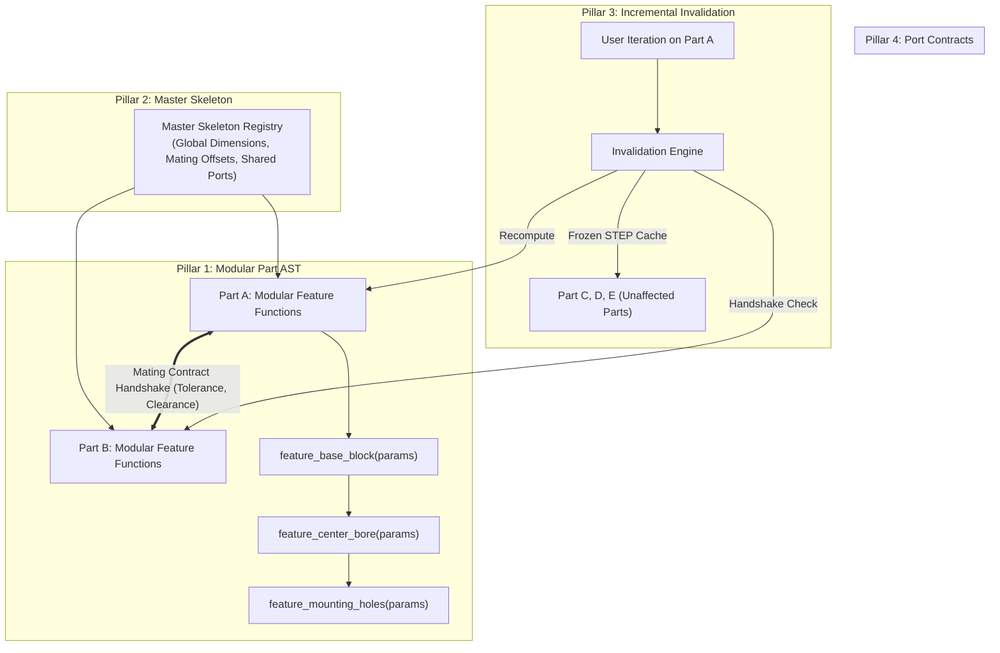

# Industrial-Grade Iteration Architecture for ForgeAgent

> [!NOTE]
> **Status**: Design Logged & Shelved for Future Implementation.  
> **Topic**: Scalable, surgical mechanical CAD iteration, multi-part coupling, and agent coding tools.

---

## 1. Executive Summary & Problem Analysis

### 1.1 The Current Iteration Paradigm
Currently, ForgeAgent handles iterations (`--iterate`) via a monolithic feedback loop:
1. Load the entire existing Python script (`central_bored_plate.py`).
2. Pass the entire raw code block into the LLM prompt alongside user modification feedback.
3. Prompt the LLM to rewrite the **entire Python script** with modifications.
4. Execute the regenerated code in the CadQuery kernel and run DFM checks.

### 1.2 Observed Failure Modes
As proven during live testing (e.g. prompt: *"remove other holes except centre hole"* resulting in extra unsolicited holes):

| Failure Mode | Root Cause | Impact |
|---|---|---|
| **Geometric Drift** | The LLM reconstructs 100% of the code from statistical memory, re-imagining unmentioned features. | Unsolicited holes, chamfers, or parameter changes appear in revisions. |
| **Monolithic Fragility** | A 500-line script for a complex part must be re-parsed and re-emitted in full for a single parameter tweak. | Token waste, slow turnaround, syntax regression risks. |
| **Cascading Assembly Breaks** | Changing a single hole on Part A does not inform Part B. | Mates fail, interference errors emerge, and full-assembly regeneration is required. |
| **Lack of Feature History** | No rollback bar or feature-level suppression exists. | Unable to isolate which specific operation broke DFM or kinematics. |

---

## 2. Theoretical Foundation: How Industrial CAD Solves This

Modern parametric CAD tools (SolidWorks, CATIA, Onshape, NX) never recreate geometry from scratch during an edit. They rely on four core concepts:

1. **Feature Trees (DAGs)**: A part is an ordered sequence of discrete geometric operations: `Sketch1 -> Extrude1 -> HolePattern1 -> Fillet1`. Editing changes only `HolePattern1` parameters without altering the base sketch.
2. **Master Modeling / Skeleton Sketches**: A shared reference model (datums, pitch circles, bounding envelopes) drives downstream part dimensions.
3. **Smart Invalidation**: Unaffected solid bodies remain cached in memory as B-Rep solids; only modified downstream features recompute.
4. **Mating Contracts**: Geometric interfaces (flanges, shafts, pin centers) have explicit mathematical coordinates and tolerances.

---

## 3. The 4-Pillar Architectural Solution



### Pillar 1: Modular Feature-Tree Code Structure
Instead of a single continuous method chain, parts are structured as composable, discrete feature functions:

```python
import cadquery as cq

# --- 1. Global Part Parameters ---
LENGTH = 100.0
WIDTH = 60.0
THICKNESS = 10.0
BORE_DIA = 25.0

# --- 2. Discrete Feature Functions ---
def feat_01_base_slab(L: float, W: float, T: float) -> cq.Workplane:
    """Base rectangular stock."""
    return cq.Workplane("XY").box(L, W, T)

def feat_02_center_bore(body: cq.Workplane, d: float) -> cq.Workplane:
    """Through-bore at origin."""
    return body.faces(">Z").workplane().hole(d)

def feat_03_fillets(body: cq.Workplane, r: float) -> cq.Workplane:
    """Outer vertical edge blends."""
    return body.edges("|Z").fillet(r)

# --- 3. Construction Recipe ---
def build_part() -> cq.Workplane:
    solid = feat_01_base_slab(LENGTH, WIDTH, THICKNESS)
    solid = feat_02_center_bore(solid, BORE_DIA)
    solid = feat_03_fillets(solid, 2.0)
    return solid

result = build_part()
```

* **Benefit for Agent**: If the user says *"remove other holes except center bore"*, the agent simply **deletes or comments out `feat_04_corner_holes`** rather than rewriting the file.

---

### Pillar 2: Master Skeleton Registry (`skeleton.json` / `params.py`)
A single source of truth for cross-part interface dimensions:
* `chassis_width = 120.0`
* `motor_mount_pitch = 45.0`
* `shaft_clearance_diameter = 8.2`

When an iteration alters a shared dimension, the skeleton broadcasts the change to all subscribed parts, eliminating manual cross-part coordination.

---

### Pillar 3: Incremental Invalidation DAG & Solid Caching
In a 20-part assembly:
* When Part 3 changes, the system consults the assembly dependency graph.
* If Parts 1, 2, 4–20 do not mate with Part 3, their evaluated solid geometries are **loaded from frozen STEP cache**.
* **Result**: Latency drops from 60 seconds to ~3 seconds; assembly verification focuses purely on the modified interface.

---

### Pillar 4: Geometric Interface Contracts & Port Handshakes
Formal interface declarations:
```python
# Part A exports:
Port(name="flange_mount", position=(40.0, 20.0, 10.0), direction=(0, 0, 1), type="hole", dia=5.0)

# Part B imports:
MatesWith(partner="PartA", port="flange_mount", type="clearance_fit")
```
If an edit on Part A moves the hole to `x=45.0`, a pre-flight mathematical check flags the misalignment immediately before expensive boolean/physics simulations run.

---

## 4. Agent Coding Skills & Surgical Tooling Strategy

When we resume this initiative, we will equip the agent with specialized skills and deterministic AST tools rather than relying purely on text prompting:

### 4.1 Required Agent Tools
1. **`cad_ast_tool`**:
   - `list_features(script_path)`: Returns all feature functions in the CadQuery file.
   - `replace_feature(script_path, function_name, new_code)`: Surgically swaps a single feature function using Python `ast` / `cst`.
   - `delete_feature(script_path, function_name)`: Removes a feature and unhooks it from `build_part()`.
   - `update_parameter(script_path, param_name, new_value)`: Modifies top-level constants deterministically without re-tokenizing.

2. **`contract_inspector_tool`**:
   - Compares exported interface comments/ports across parts in an assembly and flags broken contracts prior to CAD kernel execution.

3. **`cad_cache_manager`**:
   - Manages STEP hashes and dependency trees for sub-second assembly re-verification.

---

## 5. Resume Checklist (When We Come Back)

When returning to this work, the sequence of implementation will be:

- [ ] **Step 1**: Update [`code_generator_agent.py`](file:///home/mani_radhakrishnan/capv1_mech_design/orchestrator/agents/code_generator_agent.py) system prompt to enforce the **Modular Feature Function** template (`feat_01_*`, `feat_02_*`, `build_part()`).
- [ ] **Step 2**: Create a Python AST helper in `tools/code_ast_modifier.py` with `replace_function()` and `remove_function()` methods.
- [ ] **Step 3**: Update `orchestrator/iteration_pipeline.py` to route user edits through surgical function replacement before falling back to full-file prompts.
- [ ] **Step 4**: Introduce `skeleton.json` into multi-part runs and connect it to `code_generator_agent.py`.
- [ ] **Step 5**: Implement STEP-caching in `orchestrator/live_graph/executor.py` for untouched parts.
